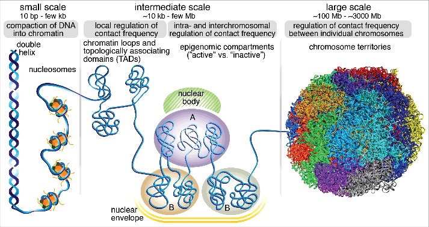

# **Biological Features vs Physical Attributes of the Genome**

---

## **Scope of the Project**

The human genome, comprising thousands of genes packaged into 23 chromosomes, is intricately folded within the nucleus of every cell. Beyond its linear sequence, the genome's three-dimensional (3D) organization plays a pivotal role in regulating biological processes. Research has revealed that this 3D configuration is highly conserved across cells and species, suggesting its fundamental role in cellular function.

This project lays the groundwork for future studies that explore the role of 3D genome organization in biological processes. By integrating computational tools and advanced experimental methods, the study aims to:
- Understand the interplay between genome structure and function.
- Investigate abnormal genomic configurations, such as in cancer cells.
- Develop predictive machine learning models for understanding cell function and devising therapeutic strategies.

---

## **About the Data**

The dataset, `genome_table_mapped.csv`, contains detailed information about mouse genes, including biological and physical attributes derived from prior research. Key features include:
- **Biological features** such as gene expression (FPKM), replication timing, and expression breadth.
- **Physical attributes** such as chromatin accessibility (TASA), distance from chromosome surface, and 3D spatial positioning.

For detailed column descriptions, refer to the **Column Descriptions** section of the notebook.

---

## **Key Steps in the Analysis**

1. **Preprocessing**:
   - Log2 transformation of FPKM values to normalize gene expression.
   - Quantile normalization of expression data to ensure uniformity across samples.

2. **Feature Engineering**:
   - Binarizing replication timing into early and late replication groups.
   - Extracting biological and physical features for modeling.

3. **Visualization**:
   - Histograms, boxplots, and heatmaps to explore data distributions and correlations.
   - Clustering and correlation heatmaps to study interactions between features.

4. **Modeling**:
   - Linear regression and machine learning models (e.g., Support Vector Regressors, Random Forests) to:
     - Predict gene expression using biological features.
     - Predict physical attributes using biological features, and vice versa.
   - Combined biological and physical features for high-accuracy predictions.

---

## **Key Results**

- **Gene Expression Prediction**:
  - Biological and physical features alone had limited predictive power.
  - Combined features significantly improved prediction accuracy.

- **Correlations**:
  - Subtle relationships were observed between replication timing, expression breadth, and some physical attributes.

---

## **Future Directions**

1. **Expand Biological Features**:
   - Include epigenetic markers, histone modifications, protein binding sites, SNPs, and functional pathways.

2. **Enhance Physical Attributes**:
   - Add features such as Radius of Gyration, local chromosome density, and fractal dimension analysis.
   - Explore the genome through network and graph theory to uncover dynamic connections.

3. **Machine Learning Applications**:
   - Train enriched datasets on advanced machine learning models for higher predictive power.

4. **Real-World Applications**:
   - Accelerate drug discovery and antigen-antibody interaction studies.
   - Identify and target cancerous genes, contributing to personalized medicine.

---

## **Getting Started**

### **Prerequisites**
- Python 3.x
- Libraries: Pandas, NumPy, Matplotlib, Seaborn, Scikit-learn

### **Installation**
1. Clone the repository:
   
   bash
   
   `git clone https://github.com/h4rrye/biological_vs_physical_genome.git`
   `cd biological_vs_physical_genome`

### Installing Dependecies:
`pip install -r requirements.txt`

---
### Usage
This notebook can be used for:

Exploring relationships between biological and physical attributes of the genome.
Testing different machine learning models for gene expression prediction.
Visualizing data distributions and correlations through clustering and heatmaps.

--- 
### Contributions
Contributions are welcome! 

---
### Acknowledgments
Special thanks to the research community for the tools and frameworks enabling this project.
